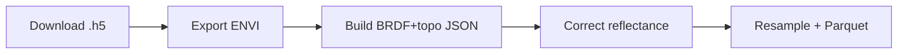

# Cross-Sensor Calibration

Cross-Sensor Calibration provides a Python pipeline for processing NEON Airborne Observation Platform hyperspectral flight lines and resampling them to emulate alternate sensors in a reproducible, scriptable workflow.


## Quickstart

> As of v2.2 the pipeline automatically downloads NEON HDF5 cubes, streams live progress
> bars, and writes every derived product into a dedicated per-flightline folder.

Install the lightweight base package:

```bash
pip install cross-sensor-cal
```

If you need the full geospatial/hyperspectral toolchain (Rasterio, GeoPandas, Spectral,
Ray, HDF5), install the optional extras:

```bash
pip install "cross-sensor-cal[full]"
```

### Quickstart Example

```python
from cross_sensor_cal.pipelines.pipeline import go_forth_and_multiply
from pathlib import Path

go_forth_and_multiply(
    base_folder=Path("output_fresh"),
    site_code="NIWO",
    year_month="2023-08",
    product_code="DP1.30006.001",
    flight_lines=[
        "NEON_D13_NIWO_DP1_L019-1_20230815_directional_reflectance",
        "NEON_D13_NIWO_DP1_L020-1_20230815_directional_reflectance",
    ],
    max_workers=2,  # Run flightlines in parallel
)
```

This automatically:

- Downloads the required NEON HDF5 flightlines with live progress bars.
- Converts each cube to ENVI with per-tile progress updates.
- Builds BRDF + topo correction JSON.
- Applies corrections, performs cross-sensor convolution, and exports Parquet tables.
- Writes every derived product into a per-flightline subfolder while leaving the raw
  `.h5` next to it for easy cleanup.

### Example Output Layout

```text
output_fresh/
├── NEON_D13_NIWO_DP1_L019-1_20230815_directional_reflectance.h5
├── NEON_D13_NIWO_DP1_L019-1_20230815_directional_reflectance/
│   ├── ..._envi.img/.hdr/.parquet
│   ├── ..._brdfandtopo_corrected_envi.img/.hdr/.json/.parquet
│   ├── ..._landsat_tm_envi.img/.hdr/.parquet
│   ├── ..._micasense_envi.img/.hdr/.parquet
│   └── NIWO_brdf_model.json
├── NEON_D13_NIWO_DP1_L020-1_20230815_directional_reflectance.h5
└── NEON_D13_NIWO_DP1_L020-1_20230815_directional_reflectance/
    └── <same pattern>
```

### Parallel Execution

By default the pipeline processes multiple flight lines in sequence. To speed up
workflows, set `max_workers` in `go_forth_and_multiply()` to run several in
parallel. Each worker operates on its own subfolder and logs are prefixed with
the flightline ID:

```
[NEON_D13_NIWO_DP1_L019-1_20230815_directional_reflectance] 🚀 Processing ...
[NEON_D13_NIWO_DP1_L020-1_20230815_directional_reflectance] 🚀 Processing ...
```

Feature availability by install type:

| Feature | Base | `[full]` |
|---|---|---|
| Core array ops (NumPy/Scipy) | ✅ | ✅ |
| Raster I/O (rasterio) | ⚠️ (not included) | ✅ |
| Vector I/O/ops (GeoPandas) | ⚠️ | ✅ |
| ENVI/HDR (spectral) | ⚠️ | ✅ |
| HDF5 (h5py) | ⚠️ | ✅ |
| Ray parallelism | ⚠️ | ✅ |

Replace `SITE` with a NEON site code and `FLIGHT_LINE` with an actual line identifier.

## Pipeline overview

Cross-Sensor Calibration processes every flight line through an idempotent
five-stage flow. Each stage streams a tqdm-style progress bar, logs with a
scoped `[flight_stem]` prefix, and writes artifacts using canonical names from
`get_flight_paths()`:



1. **Download** – `stage_download_h5()` ensures every NEON `.h5` exists before
   heavy processing begins. Downloads show live byte counters and leave the
   `.h5` beside the derived folder for easy cleanup.
2. **ENVI export** – Converts the HDF5 cube into `<flight_stem>_envi.img/.hdr`
   with chunk-level progress bars and restart-safe validation.
3. **BRDF + topo JSON** – Computes correction parameters once and reuses valid
   JSON on reruns.
4. **BRDF + topo correction** – Applies the physical correction to produce the
   canonical `<flight_stem>_brdfandtopo_corrected_envi.img/.hdr`, updating the
   progress bar for each processed chunk.
5. **Sensor resampling + Parquet** – Convolves the corrected cube to per-sensor
   ENVI pairs and emits Parquet summaries into the same per-flightline folder.

Helper utilities such as `get_flight_paths(base_folder, flight_stem)` and
`_scoped_log_prefix(prefix)` keep each worker isolated, ensure consistent
filenames, and make the parallel logs readable.

## Running the pipeline

```python
from pathlib import Path
from cross_sensor_cal.pipelines.pipeline import go_forth_and_multiply

go_forth_and_multiply(
    base_folder=Path("output_tester"),
    site_code="NIWO",
    year_month="2023-08",
    product_code="DP1.30006.001",
    flight_lines=[
        "NEON_D13_NIWO_DP1_L019-1_20230815_directional_reflectance",
        "NEON_D13_NIWO_DP1_L020-1_20230815_directional_reflectance",
    ],
    max_workers=4,
)
```

This executes the download → ENVI → BRDF+topo → resample pipeline for every
flight line, streaming progress bars along the way. After the last worker
finishes, the pipeline logs `✅ All requested flightlines processed.`.

### Idempotent / restart-safe

You can safely rerun the same command. The pipeline is stage-aware and
restart-safe:

- If a stage already produced a valid output, that stage logs a `✅ ... (skipping)`
  message and returns immediately.
- If an output is missing or looks corrupted/empty, only that stage is recomputed.
- If you crashed halfway through a long run, you can rerun the same call to resume where
  work is still needed.

A realistic rerun for one flight line now looks like (progress bars omitted for
brevity):

```
[NEON_D13_NIWO_DP1_L019-1_20230815_directional_reflectance] 🚀 Processing ...
[NEON_D13_NIWO_DP1_L019-1_20230815_directional_reflectance] 📥 stage_download_h5() found existing .h5 (skipping)
[NEON_D13_NIWO_DP1_L019-1_20230815_directional_reflectance] 🔎 ENVI export target is ..._envi.img / ..._envi.hdr
[NEON_D13_NIWO_DP1_L019-1_20230815_directional_reflectance] ✅ ENVI export already complete -> ..._envi.img / ..._envi.hdr (skipping heavy export)
[NEON_D13_NIWO_DP1_L019-1_20230815_directional_reflectance] ✅ Correction JSON already complete -> ..._brdfandtopo_corrected_envi.json (skipping)
[NEON_D13_NIWO_DP1_L019-1_20230815_directional_reflectance] ✅ BRDF+topo correction already complete -> ..._brdfandtopo_corrected_envi.img / ..._brdfandtopo_corrected_envi.hdr (skipping)
[NEON_D13_NIWO_DP1_L019-1_20230815_directional_reflectance] 🎯 Convolving corrected reflectance
[NEON_D13_NIWO_DP1_L019-1_20230815_directional_reflectance] ✅ Wrote landsat_tm product -> ..._landsat_tm_envi.img / ..._landsat_tm_envi.hdr
[NEON_D13_NIWO_DP1_L019-1_20230815_directional_reflectance] ✅ Wrote micasense product -> ..._micasense_envi.img / ..._micasense_envi.hdr
[NEON_D13_NIWO_DP1_L019-1_20230815_directional_reflectance] 📊 Sensor convolution summary | succeeded=['landsat_tm', 'micasense'] skipped=['landsat_etm+', 'landsat_oli', 'landsat_oli2'] failed=[]
[NEON_D13_NIWO_DP1_L019-1_20230815_directional_reflectance] 🎉 Finished pipeline
```

After all requested flight lines finish, the run concludes with
`✅ All requested flightlines processed.`

### Memory safety

The new pipeline will NOT keep re-loading 20+ GB hyperspectral cubes into memory on every rerun.
The ENVI export step now checks for an existing, valid ENVI pair before doing any heavy work.
If it's already there, it logs "✅ ... skipping heavy export" and moves on.

### Data products

After a successful run you should see, for each flight line:

- `<base_folder>/<flight_stem>.h5` at the workspace root for easy cleanup or
  archival.
- `<base_folder>/<flight_stem>/` containing every derived artifact:
  - `<flight_stem>_envi.img/.hdr/.parquet` (uncorrected ENVI export + summary).
  - `<flight_stem>_brdfandtopo_corrected_envi.img/.hdr/.json/.parquet` (canonical
    corrected cube).
  - `<flight_stem>_<sensor>_envi.img/.hdr/.parquet` for each simulated sensor.
  - Support files such as `NIWO_brdf_model.json` generated during correction.

The `_brdfandtopo_corrected_envi` suffix remains the canonical "final"
reflectance for analysis and downstream comparisons; all scientific semantics
are unchanged from previous releases.

### Pipeline stages

Each stage uses `get_flight_paths()` to discover its inputs/outputs and performs
restart-safe validation before doing work. Valid ENVI pairs or JSON artifacts
are reused rather than recomputed, ensuring reruns only fill in missing or
corrupted pieces. `_scoped_log_prefix()` keeps the console readable when several
flightlines run concurrently.

#### Sensor convolution / resampling behavior

- The final stage turns the corrected reflectance cube
  (`*_brdfandtopo_corrected_envi.img/.hdr`) into simulated sensor products
  (e.g. Landsat-style band stacks).
- Each target sensor is attempted independently. Missing/unknown sensor definitions
  are logged with a warning and skipped.
- Each simulated sensor writes an ENVI `.img/.hdr` pair named
  `<flight_stem>_<sensor>_envi.*`. GeoTIFFs are no longer emitted by this stage.
- If a sensor product already exists on disk and validates as an ENVI pair, it is skipped with
  a `✅ ... already complete ... (skipping)` log.
- At the end of the stage, the pipeline logs a summary of which sensors succeeded,
  which were skipped (already done), and which failed.
- The pipeline only raises a runtime error if *all* sensors failed to produce usable
  output for that flight line. Otherwise, partial success is allowed and the
  pipeline continues.

This enforced order prevents earlier bugs where convolution could run on uncorrected data.

### Developer notes

- `process_one_flightline()` is now the canonical per-flightline workflow.
- `go_forth_and_multiply()` orchestrates downloads, per-flightline workers, and
  options like `max_workers`.
- `get_flight_paths()` is the single source of truth for naming and layout of:
  - the `.h5` input,
  - the per-flightline working directory,
  - the uncorrected ENVI export,
  - the correction JSON,
  - the corrected ENVI (`*_brdfandtopo_corrected_envi.*`),
  - the per-sensor convolution outputs and Parquet summaries.

  All pipeline stages call `get_flight_paths()` instead of guessing filenames.
  If file naming changes, update `get_flight_paths()`, not each stage.

- Each stage validates its outputs (non-empty files, parseable JSON, etc.). If outputs are valid,
  that stage logs "✅ ... skipping" and returns immediately.  
  If outputs are missing or corrupted, that stage recomputes them.  
  This is what makes the pipeline resumable after a crash or partial run.

## Install

Cross-Sensor Calibration depends on GDAL, PROJ, Ray, h5py, and optional geospatial stacks such as Rasterio and GeoPandas. We recommend the Conda workflow below because it installs the required native libraries automatically. If you prefer a pure `pip` workflow, install system packages for GDAL/PROJ first (e.g., `brew install gdal` on macOS or `apt-get install gdal-bin libgdal-dev proj-bin` on Debian/Ubuntu).

### Conda

```bash
conda create -n cscal python=3.10 gdal proj
conda activate cscal
pip install -e .
```

### uv/pip

```bash
uv venv
source .venv/bin/activate
uv pip install -e .
```

If GDAL wheels are unavailable for your platform, install it from Conda-forge and then point `pip` at the Conda environment by exporting `CPLUS_INCLUDE_PATH` and `C_INCLUDE_PATH`.

## Documentation

Browse the full documentation site at
[earthlab.github.io/cross-sensor-cal](https://earthlab.github.io/cross-sensor-cal).
The site is built with MkDocs Material and automatically deployed to GitHub
Pages.

Key entry points:

- [Overview](docs/overview.md)
- [Quickstart](docs/quickstart.md)
- [Stage 01 Raster Processing](docs/stage-01-raster-processing.md)
- [Stage 02 Sorting](docs/stage-02-sorting.md)
- [Stage 03 Pixel Extraction](docs/stage-03-pixel-extraction.md)
- [Stage 04 Spectral Library](docs/stage-04-spectral-library.md)
- [Stage 05 MESMA](docs/stage-05-mesma.md)

## Support Matrix

| Python | OS            | GDAL | Ray |
|--------|---------------|------|-----|
| 3.10+  | Linux, macOS  | 3.4+ | 2.0+ |

## How to cite

If you use Cross-Sensor Calibration in your research, please cite the project:

```
Earth Lab Data Innovation Team. (2025). Cross-Sensor Calibration (Version 0.1.0) [Software]. University of Colorado Boulder. https://github.com/earthlab/cross-sensor-cal
```

Machine-readable citation metadata is provided in [CITATION.cff](CITATION.cff).

## License and Citation

Distributed under the GPLv3 License. Please cite the project using [CITATION.cff](CITATION.cff).

