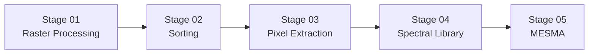

# Cross-Sensor Calibration

Welcome to the Cross-Sensor Calibration knowledge base. This site explains how
we transform raw NEON Airborne Observation Platform (AOP) hyperspectral
flightlines into analysis-ready products that emulate a range of alternative
sensors.

The documentation is organized around the production pipeline and is intended
for researchers, analysts, and developers who need reproducible spectral
processing workflows.

## What you will find here

- **Quickstarts** to help you install the tooling and run the pipeline on a test
  flightline.
- **Stage-by-stage guides** that detail every processing step from raster
  correction through MESMA analysis.
- **Configuration and reference material** that describes data schemas, naming
  conventions, and validation checks.
- **Troubleshooting tips** and frequently asked questions for when things do not
  go as expected.

## First steps

1. Read the [project overview](overview.md) for the big picture.
2. Follow the [quickstart](quickstart.md) to process a minimal dataset end to
   end.
3. Experiment with the [synthetic calibration workflow](examples/basic-calibration-workflow.md)
   to see the API in action without downloading large data files.
4. Review the [environment setup](env-setup.md) instructions before tackling a
   full production run.

## Pipeline at a glance

Each stage consumes artifacts from the previous one and exports outputs that are
ready for the next step. Dive into the dedicated pages in the pipeline section
for detailed instructions, expected inputs, and generated products.

## Need help?

If you get stuck or have feedback about the documentation, open an issue on the
[GitHub repository](https://github.com/earthlab/cross-sensor-cal/issues).

