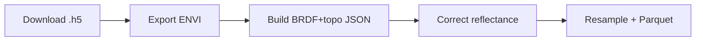

# Overview

> DO NOT EDIT OUTSIDE MARKERS
<!-- FILLME:START -->
The Cross‑Sensor Calibration workflow runs every NEON flight line through an
idempotent, restart-safe series of five stages. Each stage emits tqdm-style
progress bars, prefixes logs with `[flight_stem]`, and writes artifacts using
canonical paths from :func:`spectralbridge.utils.naming.get_flight_paths`.

- **Download:** `stage_download_h5()` restores automatic retrieval of NEON
  directional reflectance cubes and leaves each `.h5` in the workspace root for
  easy cleanup.
- **ENVI export:** Converts the HDF5 cube to
  `<base>/<flight_stem>/<flight_stem>_envi.img/.hdr/.parquet` with per-tile
  progress updates.
- **BRDF + topo JSON:** Computes correction parameters once per flight line and
  records them in `<flight_stem>_brdfandtopo_corrected_envi.json` inside the
  dedicated subdirectory.
- **BRDF + topo correction:** Streams a chunk progress bar while writing the
  canonical corrected cube (`*_brdfandtopo_corrected_envi.img/.hdr/.parquet`).
- **Sensor resample + Parquet:** Produces per-sensor ENVI pairs and matching
  Parquet summaries in the same subfolder, leaving the raw `.h5` untouched.

Every derived artifact now lives under `<base>/<flight_stem>/`, keeping the
workspace organized and allowing long-term retention of processed products
without stockpiling multi-gigabyte `.h5` inputs. `_scoped_log_prefix()` keeps
parallel runs legible while `max_workers` lets you opt into ThreadPool-powered
concurrency once downloads finish.

### Who is this for?
Researchers processing NEON AOP flight lines who need reproducible ENVI
deliverables, per-sensor band stacks, and Parquet summaries for cross-sensor
analysis. All scientific calculations remain unchanged from previous releases—
the 2025 refresh focuses on workflow, performance, and restart safety.
<!-- FILLME:END -->
