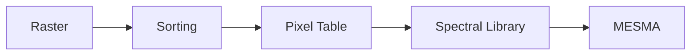

# Overview

> DO NOT EDIT OUTSIDE MARKERS
<!-- FILLME:START -->
The Cross‑Sensor Calibration workflow is organized into five sequential stages.
Each stage consumes artifacts from the previous one and produces standardized
outputs for the next.

### Raster
- **Inputs:** raw NEON AOP HDF5 flightlines and sensor configuration files
- **Outputs:** corrected, resampled rasters in ENVI/GeoTIFF format

### Sorting
- **Inputs:** processed rasters and ancillary metadata
- **Outputs:** directory tree grouped by site/date with manifests for downstream use

### Pixel Table
- **Inputs:** sorted rasters and optional vector masks or polygons
- **Outputs:** tabular spectra with pixel coordinates and metadata (`*_pixels.csv`)

### Spectral Library
- **Inputs:** pixel tables from one or more scenes
- **Outputs:** aggregated spectral library files (`spectra_library.*`) ready for analysis

### MESMA
- **Inputs:** spectral library and target rasters
- **Outputs:** Multiple Endmember Spectral Mixture Analysis results and fractional cover maps

#### Artifacts
| Stage | Key file/folder outputs |
|-------|-------------------------|
| Raster | `data/<site>/raster/*.tif` |
| Sorting | `data/<site>/sorted/` |
| Pixel Table | `pixel_tables/*.csv` |
| Spectral Library | `spectral_library/` |
| MESMA | `mesma/` (maps, summaries) |

### Who is this for?
Researchers and practitioners working with NEON AOP flightlines, drone imagery,
or Landsat scenes who need a reproducible pipeline for cross‑sensor spectral
analysis.
<!-- FILLME:END -->
