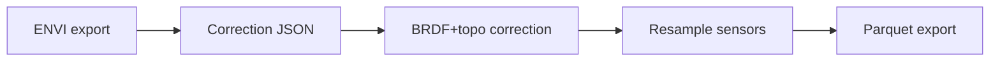

# Overview

> DO NOT EDIT OUTSIDE MARKERS
<!-- FILLME:START -->
The Cross‑Sensor Calibration workflow runs every NEON flight line through an
idempotent, restart-safe series of stages. Each stage writes ENVI (`.img/.hdr`)
artifacts using canonical names provided by
`cross_sensor_cal.utils.naming.get_flightline_products()`.

### Stage 1 · ENVI export
- **Inputs:** NEON AOP directional reflectance `.h5` flight line.
- **Outputs:** `<flight_stem>_envi.img/.hdr` written via the HyTools-free
  :func:`neon_to_envi_no_hytools` exporter.

### Stage 2 · Correction parameters
- **Inputs:** Stage 1 ENVI pair.
- **Outputs:** `<flight_stem>_brdfandtopo_corrected_envi.json` containing BRDF +
  topographic coefficients.

### Stage 3 · BRDF + topographic correction
- **Inputs:** Stage 1 ENVI pair and Stage 2 JSON.
- **Outputs:** `<flight_stem>_brdfandtopo_corrected_envi.img/.hdr`, the canonical
  science-ready reflectance cube.

### Stage 4 · Sensor convolution / resampling
- **Inputs:** Stage 3 corrected ENVI pair and the bundled sensor response
  library.
- **Outputs:** Per-sensor ENVI products named
  `<flight_stem>_<sensor>_envi.img/.hdr` (e.g. Landsat, MicaSense).

### Stage 6 · Parquet summaries *(in progress)*
- **Inputs:** Corrected ENVI pair and per-sensor ENVI products.
- **Outputs:** One Parquet table per ENVI science product for downstream
  analytics.

### Optional stages
- **Stage 7:** Masking / polygon extraction for validation workflows.
- **Stage 8:** File sorting and iRODS synchronisation via `gocmd`.

#### Key artifacts
| Stage | Primary deliverables |
|-------|----------------------|
| 1 | `<flight_stem>_envi.img` / `<flight_stem>_envi.hdr` |
| 2 | `<flight_stem>_brdfandtopo_corrected_envi.json` |
| 3 | `<flight_stem>_brdfandtopo_corrected_envi.img/.hdr` |
| 4 | `<flight_stem>_<sensor>_envi.img/.hdr` |
| 6 | `<flight_stem>_<product>.parquet` (planned) |

### Who is this for?
Researchers processing NEON AOP flight lines who need reproducible ENVI
deliverables and per-sensor band stacks for cross-sensor analysis. Downstream
workflows can build on the corrected ENVI cubes and Parquet summaries without
touching the legacy GeoTIFF toolchain.
<!-- FILLME:END -->
