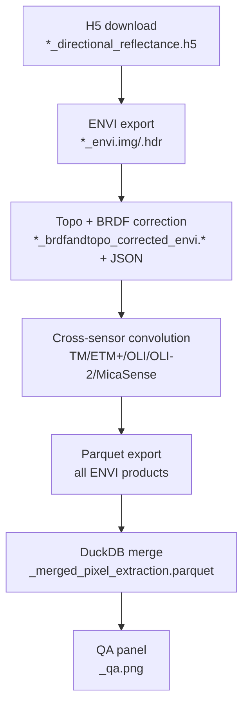

# Pipeline Stages

> TL;DR: This pipeline takes NEON hyperspectral HDF5, produces corrected ENVI cubes, optionally convolves them to other sensors, then exports tidy Parquet for analysis—plus a visual QA panel.



## 1) Download NEON HDF5
**Purpose** Pull `*_directional_reflectance.h5` tiles.  
**Inputs → Outputs** H5 → same (no transform).  
**Run it**
```bash
cross-sensor-cal download --site NIWO --year 2023 --tiles L019-1 L020-1
```
**Pitfalls** Existing files are skipped (expected).

## 2) Export to ENVI
**Purpose** Convert H5 → ENVI `.img/.hdr`.  
**Inputs → Outputs** H5 → `*_directional_reflectance_envi.img/.hdr`.  
**Run it**
```bash
cross-sensor-cal envi-export --in data/*.h5 --out envi/
```
**Pitfalls** Disk usage; `_envi` suffix used downstream.

## 3) Topographic + BRDF correction
**Purpose** Apply topo/BRDF; write sidecar JSON with parameters.
_Optional: run_ `apply_brightness_correction` _on cubes in Python before this stage
to harmonise illumination; the QA JSON will expose the per-band gain/offsets._  
**Inputs → Outputs** `*_envi.img/.hdr` → `*_brdfandtopo_corrected_envi.img/.hdr` + `*_brdfandtopo_corrected_envi.json`.  
**Run it**
```bash
cross-sensor-cal correct --in envi/*_envi.img --dtm dtm/NIWO.tif --out corrected/
```
**Pitfalls** If JSON is missing, correction didn’t run; fix paths and rerun.

## 4) Cross-sensor convolution
**Purpose** Resample to target sensor bandpasses.  
**Inputs → Outputs** corrected ENVI → `*_resampled_<sensor>_envi.img/.hdr` inside
`Convolution_Reflectance_Resample_<sensor>` directories.
**Run it**
```bash
cross-sensor-cal convolve --in corrected/*_brdfandtopo_corrected_envi.img --sensor OLI --out convolved/
```
**Pitfalls** HDR must contain a valid wavelength block.

## 5) Parquet export
**Purpose** Flatten ENVI to tidy Parquet.  
**Inputs → Outputs** ENVI products → `*.parquet`.  
**Run it**
```bash
cross-sensor-cal export-parquet --in corrected/*.img Convolution_Reflectance_Resample_*/*.img --out parquet/
```
**Pitfalls** Use `--chunksize` to keep memory low.

## 6) DuckDB merge
**Purpose** Merge parquet tables into one analysis-ready file.  
**Inputs → Outputs** `parquet/*.parquet` → `<prefix>_merged_pixel_extraction.parquet`.  
**Run it**
```bash
cross-sensor-cal merge-duckdb --in parquet/*.parquet --out merged/<prefix>_merged_pixel_extraction.parquet
```
**Pitfalls** Ensure filenames follow [Outputs](outputs.md) conventions before merging.

## 7) QA panel
**Purpose** Visual checks and metrics; saves `<prefix>_qa.png` and `<prefix>_qa.json`.
**Run it**
```bash
cscal-qa --base-folder processed/flightlines --quick
```
**Pitfalls** Deterministic quick mode samples ~25k pixels; rerun with `--full` if you need denser stats.

## File-naming at a glance
- Raw H5 → `..._directional_reflectance.h5`
- ENVI export → `..._directional_reflectance_envi.img/.hdr`
- Corrected → `..._brdfandtopo_corrected_envi.img/.hdr` + JSON
- Convolved → `..._brdfandtopo_corrected_envi_<sensor>.img/.hdr`
- Merged parquet → `<prefix>_merged_pixel_extraction.parquet`
- QA → `<prefix>_qa.png`
